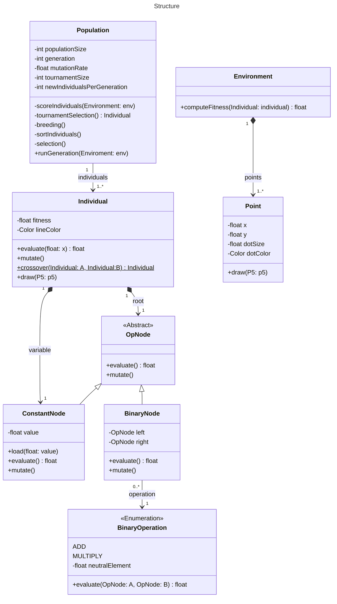

# Genetic Programming Simple Regression

## Introduction

This is an experiment to see if I can implement genetic programming from scratch to solve a simple regression problem. The problem is to find a function that fits some 2d points on a plane. The data is generated by a function that takes a single input and returns a single output.

## Class structure

